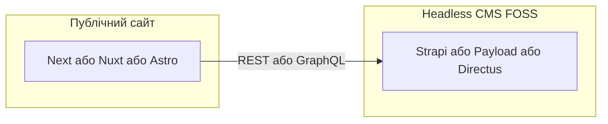

# Технічне завдання: корпоративний сайт ліцею родини Шрайбер

## 1. Контекст і цілі

**Замовник:** Білоцерківський корпоративний ліцей родини Шрайбер.  
**Референс поточного сайту:** [sflyceum.com](https://www.sflyceum.com/) — базова структура та зміст; нова версія має бути сучаснішою за візуалом, UX, швидкістю та зручністю супроводу.

**Бізнес-цілі:**

- Офіційний інформаційний канал для батьків, учнів, партнерів і громадськості.
- Прозоре оприлюднення документів (ліцензія, статут, накази, освітній процес).
- Актуальні новини та оголошення без залучення розробника для типових змін.
- Підтримка іміджу сучасного закладу освіти.

**Обмеження з опитування:**

- **Мови:** українська та англійська (контент і навігація).
- **Адміністрування:** змішана команда — частина користувачів без IT, частина з підтримкою IT; адмінка має бути інтуїтивною для перших і достатньо гнучкою для других.
- **Сучасний движок (обов’язково):** публічна частина реалізується на **актуальному JS/TS-фреймворку** з **компонентною архітектурою**, підтримкою **SSR та/або SSG** (і за потреби **edge**), сучасним toolchain збірки (наприклад Vite під капотом). Допустимі базові варіанти: **[Next.js](https://nextjs.org/)**, **[Nuxt](https://nuxt.com/)**, **[Astro](https://astro.build/)** (з інтеграцією React/Vue за потреби), **[SvelteKit](https://kit.svelte.dev/)** — фінальний вибір фіксується після PoC. **Не відповідає вимозі:** сайт «на чистому PHP-шаблоні» без цього фронтенд-шару як основного способу рендерингу UI; застарілі стеки без SSR/SSG і без модульної фронтенд-архітектури.
- **Ліцензії:** лише **безкоштовне ПЗ** з відкритим кодом або вільними ліцензіями (MIT, Apache-2.0, GPL тощо); платні плагіни та підписки на ПЗ — поза межами базового ТЗ.
- **WordPress:** **не використовується** (ні як моноліт, ні як headless CMS для цього проєкту) — на вимогу замовника.
- **Хостинг:** «сучасний движок» зазвичай потребує **Node.js** у рантаймі або **статичного/edge** деплою; типовий **лише shared PHP без Node** часто **не підходить** для повного рішення — передбачається **PaaS з Node** (наприклад безкоштовні/дешеві рівні з обмеженнями), **VPS**, або **статичний фронт** (Astro/SSG) + **окремий** хостинг для API CMS; конкретна схема описується в інструкції з розгортання.

---

## 2. Цільова аудиторія публічної частини

| Сегмент                  | Потреби                                               |
| ------------------------ | ----------------------------------------------------- |
| Батьки майбутніх учнів   | Вступ, документи, контакти, довіра (ліцензія, статут) |
| Поточні батьки / учні    | Новини, накази, календар подій (за наявності)         |
| Партнери / громадськість | Про заклад, контакти, офіційні матеріали              |

---

## 3. Функціональні вимоги — публічний сайт

### 3.1 Структура та розділи (мінімум; узгоджується з замовником)

На основі поточного сайту та типової практики ЗЗСО:

- **Головна:** короткий про заклад, ключові посилання, останні новини, можливо слайдер/банер.
- **Про ліцей:** історія, місія, керівництво (за потреби), **ліцензія**, **статут** (PDF або сторінки з текстом + завантаження).
- **Новини / анонси:** стрічка з пагінацією, картка новини (дата, заголовок, короткий опис, зображення), окрема сторінка новини.
- **Освітній процес:** підрозділи або список документів (накази, атестація тощо) — з датами та файлами для завантаження.
- **Контакти:** адреса, карта, телефони, email, форма зворотного зв’язку (див. безпеку та спам).
- **Юридичне / службові сторінки:** політика конфіденційності, cookies (якщо застосовується аналітика).

Усі перелічені типи сторінок мають підтримувати **українську та англійську** версії контенту (URL або префікс мови — на етапі проєктування UI/UX).

### 3.2 Двомовність (i18n)

- Перемикач мови у шапці/футері; збереження вибраної мови (cookie або localStorage).
- Для кожної сутності (сторінка, новина, меню): або окремі поля UA/EN у CMS, або окремі записи з прив’язкою перекладу — підхід фіксується в проєкті на основі обраної CMS.
- Мета-теги та Open Graph для обох мов, коректні `hreflang` для SEO.

### 3.3 Дизайн і UX (сучасні тренди)

- Адаптивна верстка (mobile-first): телефони, планшети, десктоп.
- Доступність: контраст, фокус-стани клавіатури, семантична розмітка, осмислені `alt` для зображень (вимоги WCAG 2.1 рівня AA — як ціль).
- Швидке завантаження: оптимізація зображень (сучасні формати, lazy load), мінімізація блокуючих ресурсів.
- Візуальна ідентичність: кольори/типографіка ліцею (брендбук за наявності; інакше — прототип палітри на етапі дизайну).

### 3.4 Форма зворотного зв’язку

- Поля: ім’я, email, тема, повідомлення; захист від спаму (reCAPTCHA / hCaptcha або аналог).
- Відправка на корпоративну пошту або через транзакційний сервіс пошти; логування заявок у адмінці — опційно.

---

## 4. Функціональні вимоги — адмін-панель (CMS)

### 4.1 Ролі та доступ

- Ролі на кшталт: **Редактор контенту** (новини, сторінки без критичних налаштувань), **Адміністратор** (користувачі, меню, налаштування сайту), за потреби **Тільки перегляд**.
- Аутентифікація з надійними паролями; опційно 2FA для адміністраторів.

### 4.2 Управління контентом

- CRUD для новин, статичних сторінок, завантажуваних документів (PDF тощо).
- **Медіа-бібліотека:** завантаження зображень і файлів, повторне використання, базові метадані.
- **Меню:** редагування пунктів головного та футер-меню без коду.
- **Попередній перегляд** опублікованого вигляду (бажано) або чернетки з публікацією за розкладом.

### 4.3 Зручність для «нема IT»

- WYSIWYG або блочний редактор для тексту новин і сторінок.
- Підказки/обмеження полів (обов’язковий заголовок, дата новини).
- Можливість **дублювати** новину для перекладу на другу мову (workflow узгоджується).

### 4.4 Підтримка IT / підрядника

- Експорт резервної копії БД / контенту (залежить від CMS).
- Документований деплой (staging + production).
- Логи помилок на сервері (мінімум для продакшену).

---

## 5. Нефункціональні вимоги

| Область                 | Вимога                                                                                                                                             |
| ----------------------- | -------------------------------------------------------------------------------------------------------------------------------------------------- |
| **SEO**                 | ЧПУ, sitemap.xml, robots.txt, базові meta title/description керовані з CMS                                                                         |
| **Безпека**             | HTTPS, захист форм, оновлення залежностей, мінімізація витоку версій CMS                                                                           |
| **Продуктивність**      | Цільові показники Lighthouse (Performance/Best Practices) — узгодити пороги на етапі приймання                                                     |
| **Резервне копіювання** | Регулярні бекапи БД і файлів; план відновлення                                                                                                     |
| **Хостинг**             | Сумісний із обраним стеком (Node / static+edge / VPS); регіон ЄС/Україна за вимогами до даних; інструкція розгортання для підрядника та IT закладу |

---

## 6. Рекомендований технічний стек (сучасний движок + адмінка, FOSS)

Архітектура відповідає вимозі **сучасного движка**: розділення **публічного фронту** (JS-фреймворк) та **headless CMS** з готовою адмін-панеллю.

### 6.1 Публічний сайт (обов’язково — один із сучасних фреймворків)

- **[Next.js](https://nextjs.org/)** (React) — App Router, SSR/SSG, зручний i18n routing.
- **[Nuxt](https://nuxt.com/)** (Vue) — аналогічно для екосистеми Vue.
- **[Astro](https://astro.build/)** — мінімум JS у клієнті, добре для контентних сторінок; для інтерактиву — острова React/Vue.
- **[SvelteKit](https://kit.svelte.dev/)** — альтернатива з легким бандлом.

Кодова база фронту — бажано **TypeScript**; залежності лише з **відкритими** ліцензіями.

### 6.2 CMS та API (безкоштовні headless-рішення)

- **[Payload CMS](https://payloadcms.com/)** (Node + MongoDB/Postgres) — сучасна модель контенту, адмінка на React.
- **[Strapi](https://strapi.io/)** — зрілий екосистемний варіант, плагіни i18n у безкоштовному сегменті перевіряти окремо.
- **[Directus](https://directus.io/)** — шар над SQL-БД, гнучка схема.

Порівняння на етапі **PoC:** i18n (UA/EN), ролі, медіа, зручність редакторів без IT.

### 6.3 Що не входить у базовий стек

- **WordPress** — виключено за вимогою замовника.
- Монолітні PHP-CMS **без** окремого фронтенду на фреймворку з п. 6.1 — **не** задовольняють вимогу «сучасний движок» для публічної частини.

### 6.4 Інфраструктура

- **Docker Compose** (або аналог) для локалі та staging: фронт + CMS + БД — відтворюваність.
- **CI/CD:** збірка фронту, міграції CMS, деплой на production.
- Продакшен: **VPS** або **PaaS** з підтримкою Node; або **SSG/edge** для фронту + окремий URL для CMS (типова схема документується).

---

## 7. Етапи робіт (високорівнево)

1. **Збір вимог і контент-аудит** — перенесення з [sflyceum.com](https://www.sflyceum.com/), список PDF, пріоритет розділів.
2. **UX/UI** — прототипи, дизайн-система, мобільна версія.
3. **Налаштування CMS** — моделі даних, ролі, медіа, i18n.
4. **Розробка фронту** — сторінки на обраному сучасному фреймворку, інтеграція з API CMS, форма зв’язку.
5. **Наповнення та переклад EN** — разом із замовником.
6. **Тестування** — кросбраузер, доступність, навантаження форм.
7. **Навчання** — короткий відео/док або сесія для редакторів.
8. **Запуск і гарантійна підтримка** — термін узгоджується в договорі.

---

## 8. Критерії приймання (фрагмент)

- Усі розділи з п. 3.1 доступні на UA та EN (де контент надано замовником).
- Редактор без коду може опублікувати новину та прикріпити PDF.
- Сайт коректно відображається на мобільних; форма не відправляє спам без перевірки.
- Документація з деплою та резервного копіювання передана.
- **Сучасний движок:** публічний сайт зібраний на **фреймворку з п. 6.1** (підтверджується `package.json`, структурою проєкту); **WordPress відсутній** у залежностях і на сервері як CMS.
- Усі компоненти стека — **FOSS** з фіксованими версіями у акті здачі.

---

## 9. Ризики та відкриті питання до замовника

- Наявність **брендбуку** (логотип вектор, кольори, шрифти).
- **Юридичне узгодження** текстів EN (хто перекладає / вичитує).
- **Домен і хостинг:** залишається sflyceum.com чи зміни; хто володіє DNS; **чи готовий тариф до Node/VPS або edge** під обраний стек.
- Інтеграції на майбутнє: Google Calendar, соцмережі, розсилка — чи входять у MVP.

Цей документ можна передати розробнику як основу ТЗ; деталізація полів CMS і макетів — у специфікації після затвердження структури та дизайну.